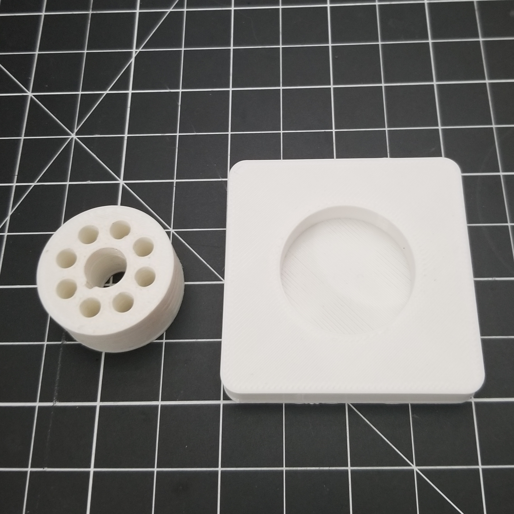

# vacuum-tube-toolbox

A work in progress OpenSCAD library (and eventually KiCad designs) to make tinkering with vacuum tubes quicker/easier.

## Current Features

- Tube holders (single/multiple)
- Plugin coils for building old radio coil tubes

## Images

## Hardware

For 3D prints with holes/slots I generally use a 0.1mm tolerance 
to account for errors and/or print bed deformation.

### Pins

Vacuum tube pins can be found by searching for "swage mount pins".
This honestly took me forever to find the right google search.

I sourced from:
- https://www.digikey.com/en/products/detail/mill-max-manufacturing-corp/3104-2-00-15-00-00-08-0/436491
- https://www.digikey.com/en/products/detail/mill-max-manufacturing-corp/4395-0-00-15-00-00-08-0/10063634
- https://www.digikey.com/en/products/detail/mill-max-manufacturing-corp/6331-0-00-15-00-00-08-0/10063644
- https://www.mill-max.com/products/new/swage-mount-pcb-pins-for-interconnect-applications
- https://www.mill-max.com/search/tags/swage_mount?src=19

I think that pins can be made by hand by working hollow 2-3mm brass tubing.
This would probably be cheaper and more convenient, but I have not pursued this seriously yet.

For installing pins, print base with pin diameters around 0.05 mm smaller.
Then, heat up pin with soldering iron and melt the pin into the base.

## Building a Socket Saver

- Print mounted tube socket with pin diameter of 3mm and mount pin diameter of 2mm.
- Prepare pin components.
  - **pin** - 21mm segment of 1.5mm diameter magnet wire.
  - **pin socket** - 10mm x 16mm copper foil cut out.
- Sand ~5mm on both ends of magnet wire pin.
- Wrap copper foil segment around pin. Then, Solder foil to pin, making sure not to add extra diameter.
- Use multimeter to check continuity of each pin
- Insert completed pin with pin socket into tube socket.
  - If loose, consider super gluing or increasing diameter of pin socket.
- Slightly insert vacuum tube and recheck continuity between tube pins and socket pins.

## Future Features

Hoping to get to these items as other projects require them.

- Breakout boards for common tube types (KiCad)
- Breadboard adapters for common tube types (KiCad)
- attempt all basic socket types listed in - https://en.wikipedia.org/wiki/Tube_socket#Summary_of_base_details

## Development Dependencies

- OpenSCAD 2021.01+ - `apt-get -y install openscad`

## References

- https://en.wikipedia.org/wiki/Tube_socket
